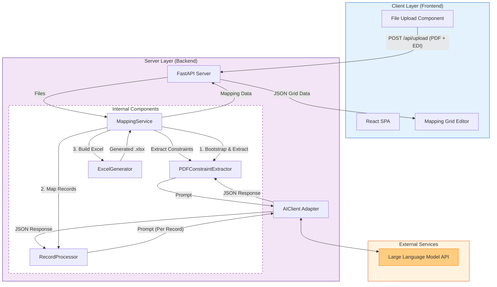

# EDI 850 (Inbound Purchase Order) Architecture

## Overview
The 850 flow architecture follows a modern Client-Server pattern, leveraging a React frontend for user interaction and a Python FastAPI backend for core processing, integrated with an external LLM for intelligent extraction and mapping.

## System Components

### 1. Client Layer (Frontend)
*   **React Application**: Single Page Application (SPA) built with Vite/React.
*   **Role**: Handles file uploads (PDF + EDI), displays processing status, renders the editable Mapping Grid, and manages file downloads.

### 2. Server Layer (Backend)
*   **API Gateway**: `api_server.py` (FastAPI). Exposes REST endpoints for upload, generation, and updates.
*   **Service Layer**: `MappingService`. Orchestrates the session state and calls specific processors.
*   **Core Logic**: 
    *   `PDFConstraintExtractor`: Parses PDF for mandatory fields.
    *   `RecordProcessor`: Handles record-by-record mapping logic (Phase 3).
    *   `ExcelGenerator`: Formats the final output.

### 3. Intelligence Layer (AI)
*   **AI Client**: `src/ai_client.py`. Manages authentication and communication with the External LLM.
*   **External LLM**: Processes complex prompts to extract constraints and perform semantic mapping.

## Architecture Diagram

