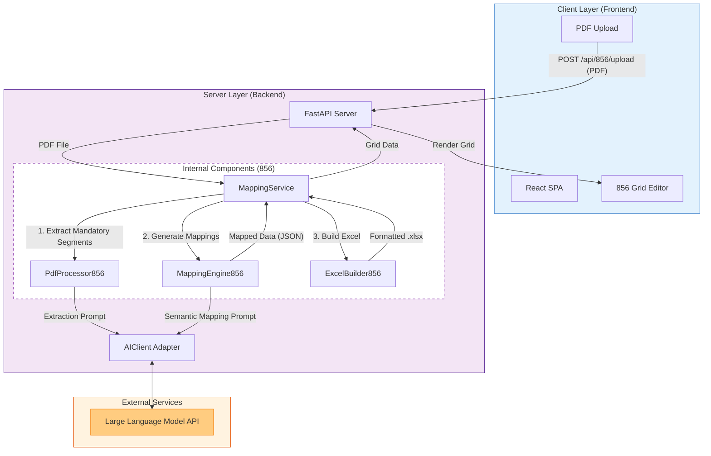

# EDI 856 (Outbound Advance Ship Notice) Architecture

## Overview
The 856 flow follows a specialized pipeline designed for Outbound mapping. It shares the same Frontend and API shell as the 850 flow but utilizes a distinct set of internal processing components optimized for extracting Vendor requirements and mapping them to ERP output fields.

## System Components

### 1. Client Layer (Frontend)
*   **React Application**: Provides the "856 Workflow" UI.
*   **Role**: Handles PDF-only upload, renders the 856-specific Grid (columns A-H structure), allows cell editing, and manages Excel download.

### 2. Server Layer (Backend)
*   **API Gateway**: `api_server.py`. Routes requests to the 856-specific endpoints (`/api/856/*`).
*   **Service Layer**: `MappingService`. Acts as the controller, initializing the 856 processors and managing session data.
*   **Core Logic**:
    *   `PdfProcessor856`: Specialized extractor for "Mandatory" and "Must Use" segments from Vendor PDFs.
    *   `MappingEngine856`: AI-driven engine that aligns Vendor fields to ERP Interface fields and determines Logic Types (Constant, Translation, etc.).
    *   `ExcelBuilder856`: Generates the specific `PaceSupply_856_Outbound.xlsx` format.

### 3. Intelligence Layer (AI)
*   **AI Client**: Shared adapter for LLM communication.
*   **External LLM**: Performs two key tasks: 1) Structure extraction from PDF text, 2) Semantic mapping of Field Definitions.

## Architecture Diagram

